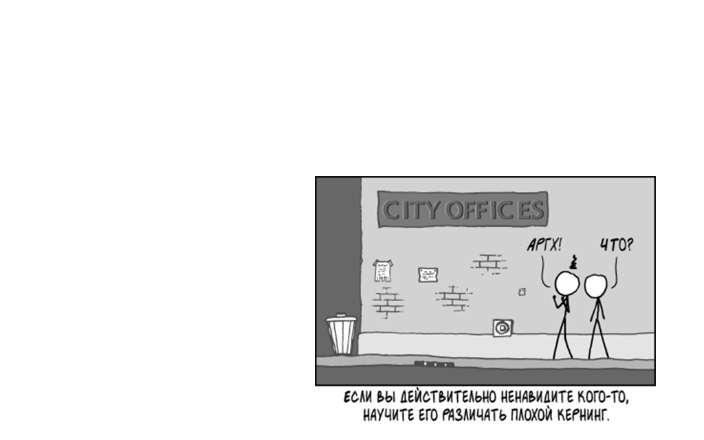

---

layout: ribbon

style: |

    #Cover div {

    }

    #Cover h2 {
        margin: 0;
        color:#666;
        font-size:70px;
        }
    #Cover p {
        margin:10px 0 0;
        color:#000;
        font-style:italic;
        font-size:20px;
        }

    #Picture h2 {
        color:#FFF;
        }
    #SeeMore h2 {
        font-size:100px
        }
    #SeeMore img {
        width:0.72em;
        height:0.72em;
        }
---

# Justify, от которого не тошнит {#Cover}

*Алексей Иванов и Александр Остапенко*

<!-- photo by John Carey, fiftyfootshadows.net -->

## Пример обычного текста

[картинка с длинным параграфом (150 знаков), 13-м кеглем и 1.2 межстрочным расстоянием ]

##Более читабельный текст

[60-70 символов, 16-20 кегль, 1.5 межстрочка]

## Что плохо в обычном экранном тексте без обработки

1. Неправильные места для переносов: Предлоги и союзы, инициалы, etc
2. Неровный правый край
3. Что-то еще?

## Более читабельный текст с подсветкой ошибок

[слайд с подсветкой неправильных переносов, оторванных предлогов и прочего, показываем дыры в правом крае, etc]

## Библиотеки для автоматической серверной типографики

1. mdash.ru
2. Типограф Лебедева
3. Что-то еще

## Более читабельный текст с расставленной типографикой

[слайд примера сразу с подсветкой больших дыр на месте переносов]

## Книжный абзац

[Пример того же текста размеченного по всем типографским правилам]

## Абзац с примененным джастифаем без переносов

[показываем ужас]

## hyper.js

1. http://www.bramstein.com/projects/hypher/
2. Словарь переносов

## Абзац с примененным джастифаем и переносам

[показываем средний ужас]

## Правила разбиения по абзацам

1. Допускается размер пробела от 0.25 до 1.25 em. В последних строках стандартный размер.
2. При наборе с text-indent концевая строка абзаца должна быть больше абзацного отступа не менее чем в 1,5 раза и короче полной строки не менее чем на 1.5em или быть полной.
3. При наборе на большой формат в книжных изданиях допускается не более четырех переносов подряд.
4. Тире в начале абзацного отступа должно быть отделено от последующего текста полукегельной.
5. Не допускается совпадение пробелов между словами по вертикали или диагонали в четырех или более смежных строках («коридоры»).
6. Междусловные пробелы в смежных строках не должны резко отличаться между собой. 

## Правила разбиения на слога

1. Минимальная длина для оставляемого куска 4 символа.
2. Минимальная длина для переносимого куска 3 символа.
3. Не допускается разделение переносами сокращений, набираемых прописными буквами (ВЛКСМ), прописными с отдельными строчными (КЗоТ) и с цифрами (ФАIООО).

## Абзац с примененным джастифаем и переносам

[Картинка с подсвеченными ошибками]

## Путь к спасению. Автоматическое разбитие на строки с учетом варантов

1. first-fit
2. best-fit
3. etc

## Алгоритм Кнута-Пласса

1. Бокс
2. Клей
3. Штраф

## Пример разбитого предложения
[Картинка примера]

## Пример разбитого текста

[Картинка текста]

## Подсветка неправильных отступов после тире
[картинка]

## Где поиграться

http://github.com/ridero/путь_к_репозиторию

## Вопросы

[Слайд с контактами, твитерами, доменом ридеро и проч.]

