---

layout: ribbon
title: Justify, от которого не тошнит
subtitle: Алексей Иванов и Александр Остапенко

style: |

    #Cover div {

    }

    #Cover h2 {
        margin: 0;
        color:#666;
        font-size:70px;
        display: block;
        }
    #Cover p {
        margin:10px 0 0;
        color:#000;
        font-style:italic;
        font-size:20px;
        }

    #Picture h2 {
        color:#FFF;
        }
    #SeeMore h2 {
        font-size:100px
        }
    #SeeMore img {
        width:0.72em;
        height:0.72em;
        }
    .cover h2 { display: none; }

    .slide::after, .badge { display: none !important; }

    .slide pre code {
        line-height: 1.2 !important;
        font-size: 16px;
    }

    .slide pre { margin-top: -30px; }

---

# Justify, от которого не тошнит {#Cover}

*Алексей Иванов (@iadramelk) и Александр Остапенко (@alexalx13)*

<!-- photo by John Carey, fiftyfootshadows.net -->

## Pictures
{:.cover }

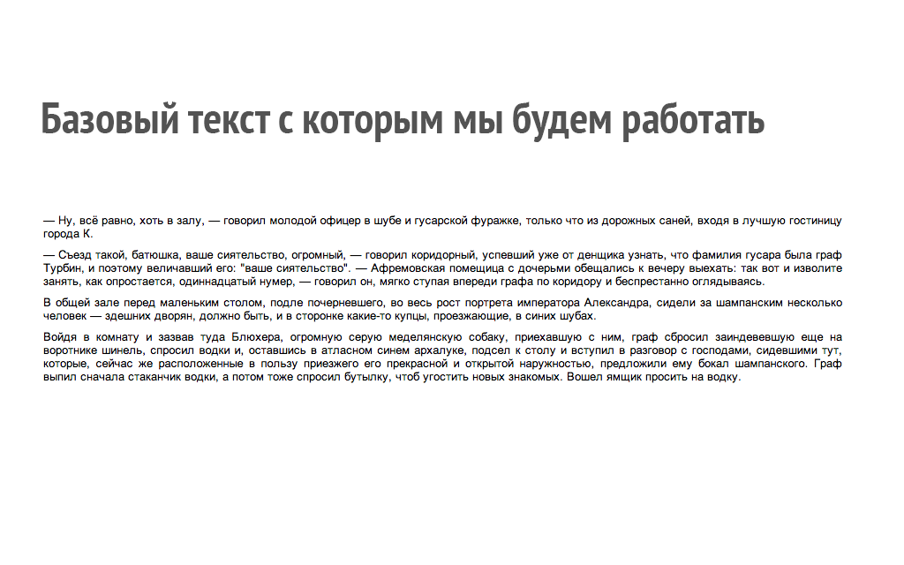

## Pictures
{:.cover }

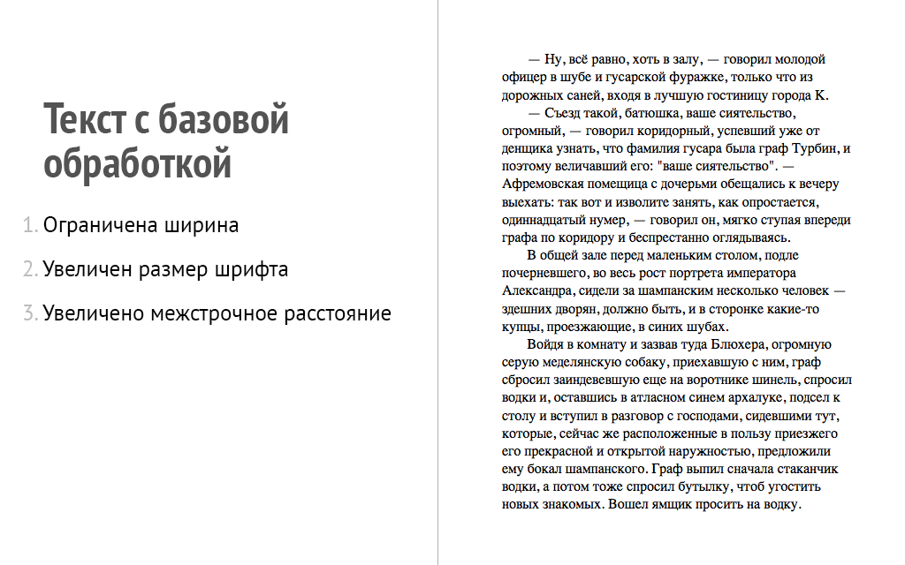

## Pictures
{:.cover }

## Типографика

1. [mdash.ru](http://mdash.ru)
2. [Типограф Лебедева](http://www.artlebedev.ru/tools/typograf/)
3. Тысячи других

## Pictures
{:.cover }

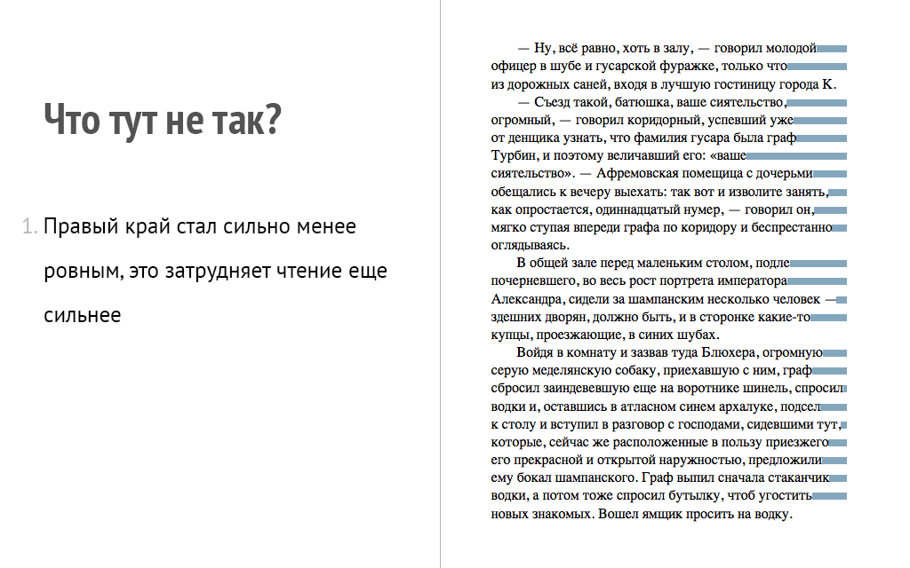

## Pictures
{:.cover }

## Pictures
{:.cover }

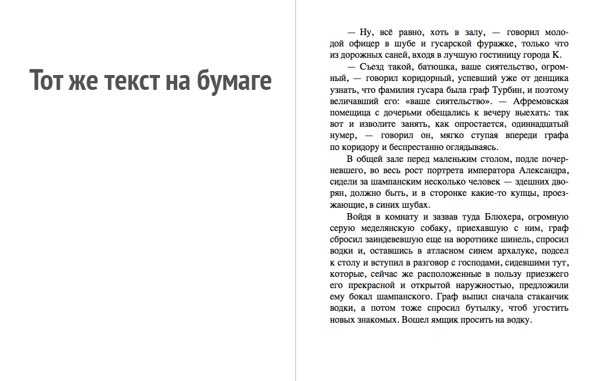

## Pictures
{:.cover }

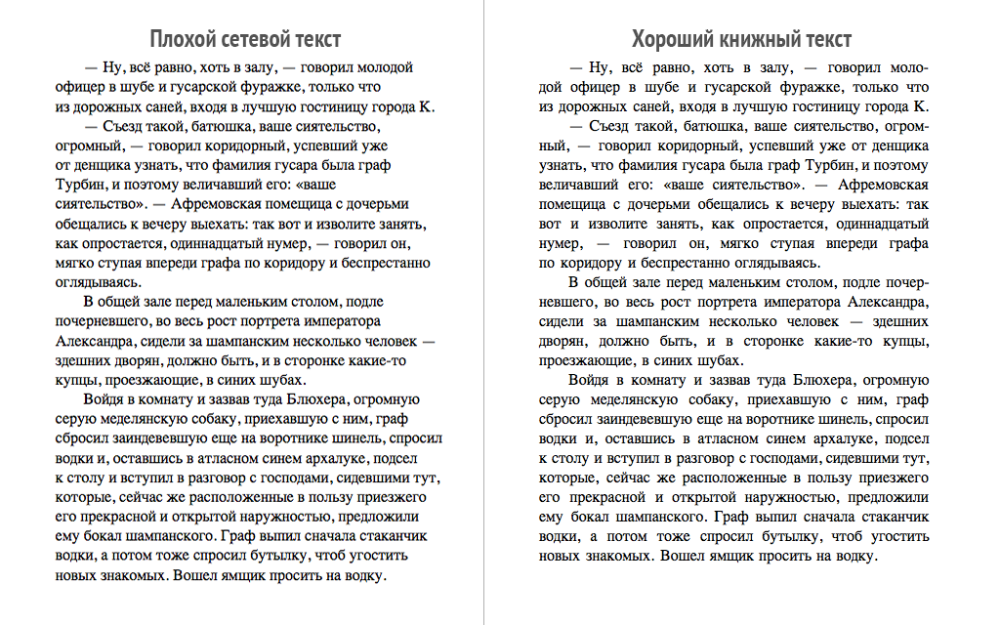

## Pictures
{:.cover }

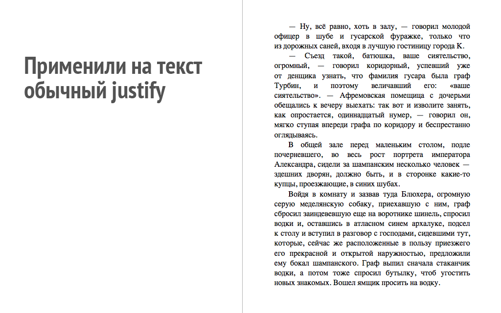

## Pictures
{:.cover }

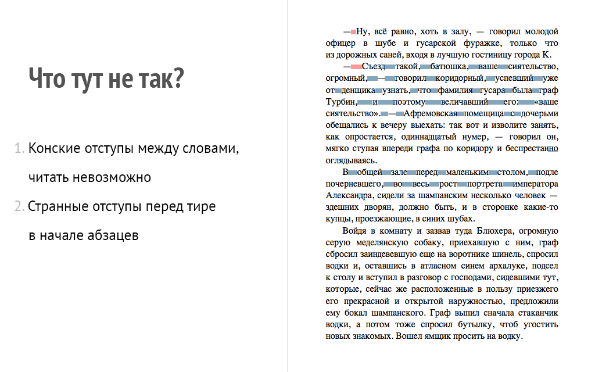

## Библиотеки для расстановки переносов

1. [hyper.js](http://www.bramstein.com/projects/hypher/) + Словарь переносов
2. [hypenator.js](https://code.google.com/p/hyphenator/)
3. [http://quittance.ru/hyphenator.php](http://quittance.ru/hyphenator.php)
4. [http://quittance.ru/blog/index.php?category=21](http://quittance.ru/blog/index.php?category=21) - описание алгоритма

## Pictures
{:.cover }

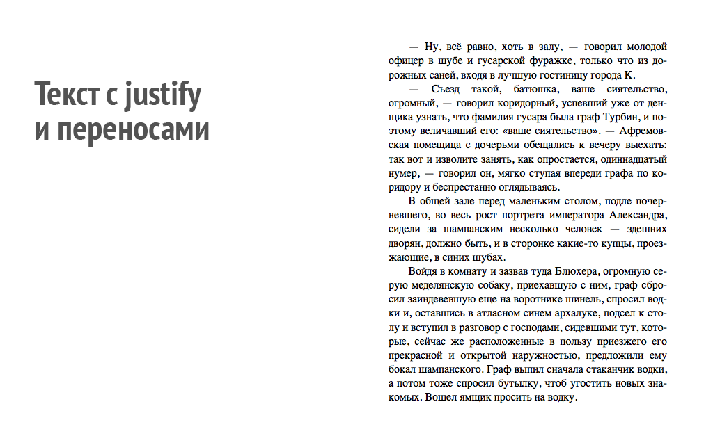

## Pictures
{:.cover }

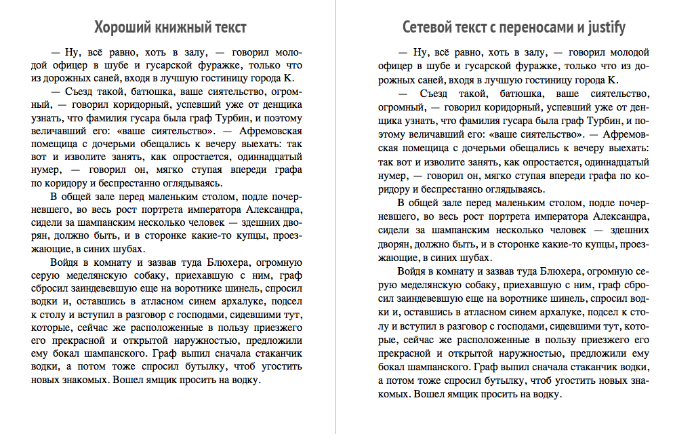

## Pictures
{:.cover }

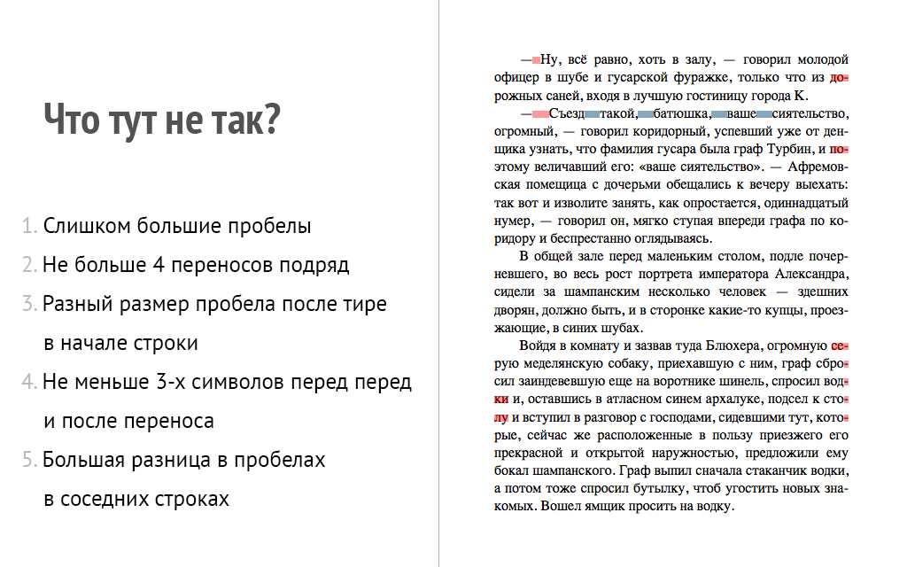

## Pictures
{:.cover }

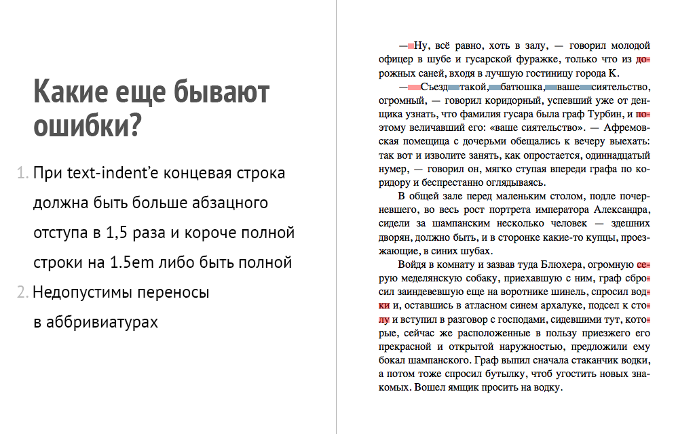

## Правильная настройка переносов

1. Минимальная длина для оставляемого куска 3 символа.
2. Минимальная длина для переносимого куска 3 символа.
3. Не допускается разделение переносами сокращений, набираемых прописными буквами (ВЛКСМ), прописными с отдельными строчными (КЗоТ) и с цифрами (ФАIООО).
4. Переносить последнее слово в абзаце не рекомендуется.

## Pictures
{:.cover }

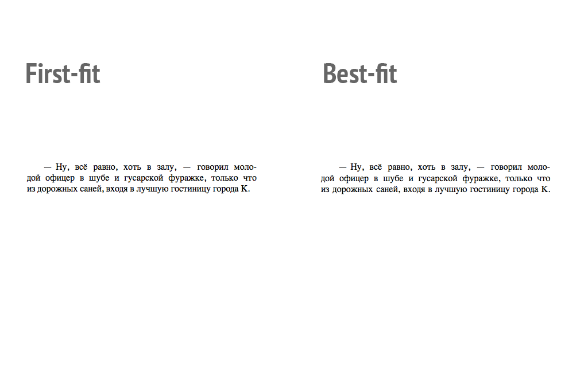

## Алгоритм Кнута-Пласса

Реализация для веба: [http://www.bramstein.com/projects/typeset/](http://www.bramstein.com/projects/typeset/)    

1. <strong>Бокс:</strong> Базовый блок текста, у него есть ширина.
2. <strong>Клей:</strong> Элемент с изменяемым размером. У него есть три параметра: Базовая ширина, насколько его можно растянуть, насколько его можно сжать. Пример: 1/3, 1/9, 1/6.
3. <strong>Штраф:</strong> Место где допустим или недопустим перенос. У него есть ширина и коэффицент штрафа и флаг.

## Пример разбитого предложения

Вошел ямщик просить на водку.

    box (w(indent))                 — параграфный отступ
    penalty (0, ∞, false)           — запрет переноса
    box (w(вошел))                  — "вошел"
    glue (1em/3, 1em/18, 1em/27)    — пробел
    box (w(ямщик))                  — "ямщик"
    glue (1em/3, 1em/18, 1em/27)    — пробел
    box (w(про))                    — "про"
    penalty (w('-'), 100, true)     — мягкий перенос
    box (w(сить))                   — "сить"
    glue (1em/3, 1em/18, 1em/27)    — пробел
    box (w(на))                     — "на"
    penalty (0, ∞, false)           — запрет переноса
    glue (1em/3, 1em/18, 1em/27)    — пробел
    box (w(водку))                  — "водку."
    penalty (0, ∞, false)           — запрет переноса
    glue (0, 1em/18, 1em/27)        — пробел а последней строке
    penalty (0, —∞, false)          — принудительный перенос

## Pictures
{:.cover }

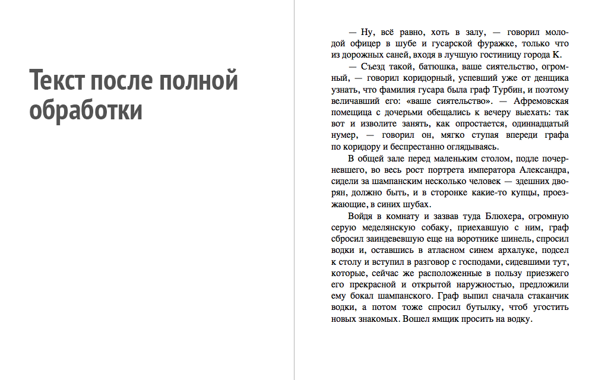

## Pictures
{:.cover }

## Pictures
{:.cover }

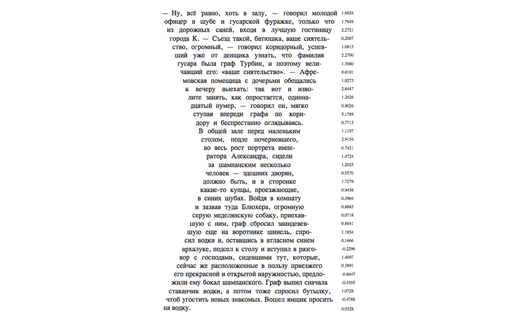

## Pictures
{:.cover }

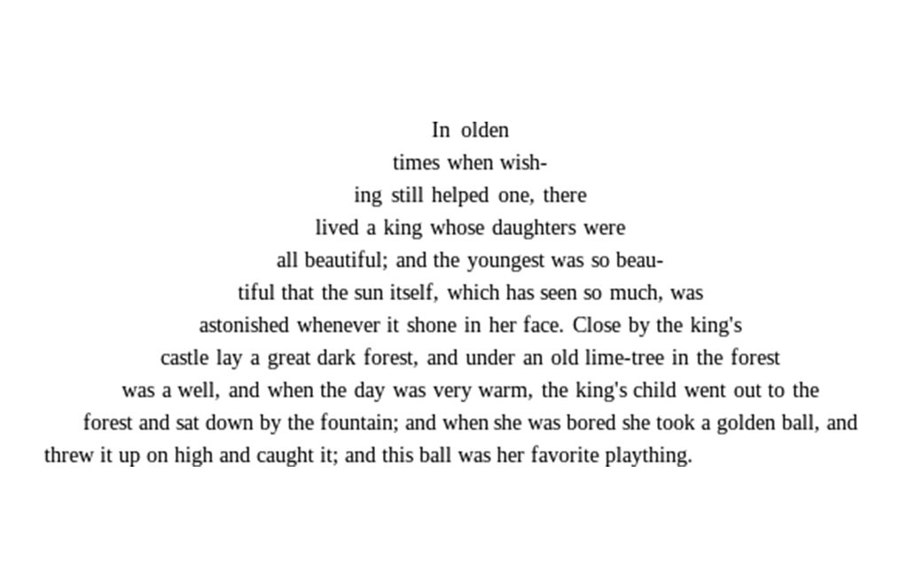

## Pictures
{:.cover }

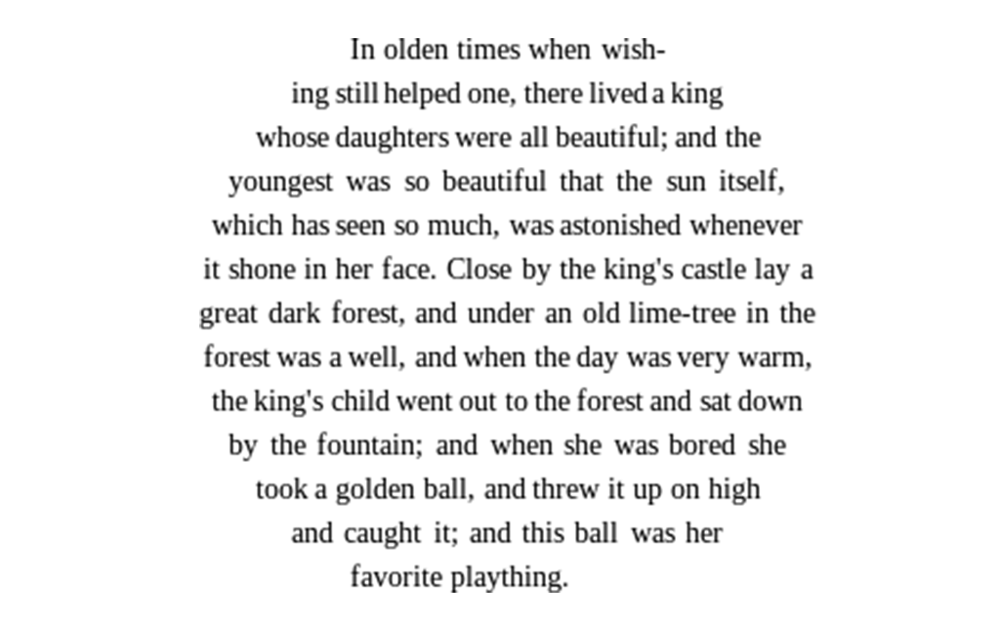

## Ссылки

- Где поиграться: [http://github.com/ridero/fronttalks](http://github.com/ridero/fronttalks
)
- Когда-нибудь тут будет сервис по подготовке книг к печати: [http://ridero.ru](http://ridero.ru)
- Мы в Твиттере: @iadramelk и @alexalx13
- Вопросы?
